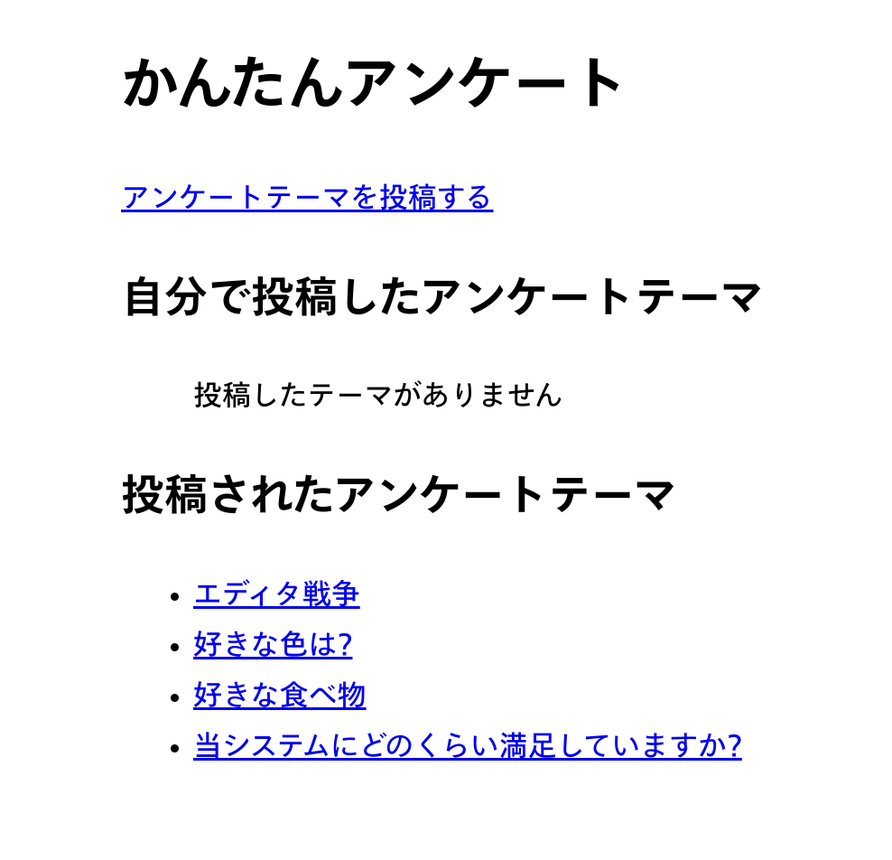
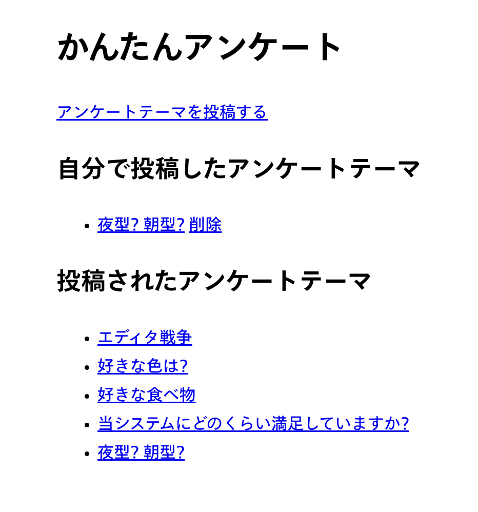
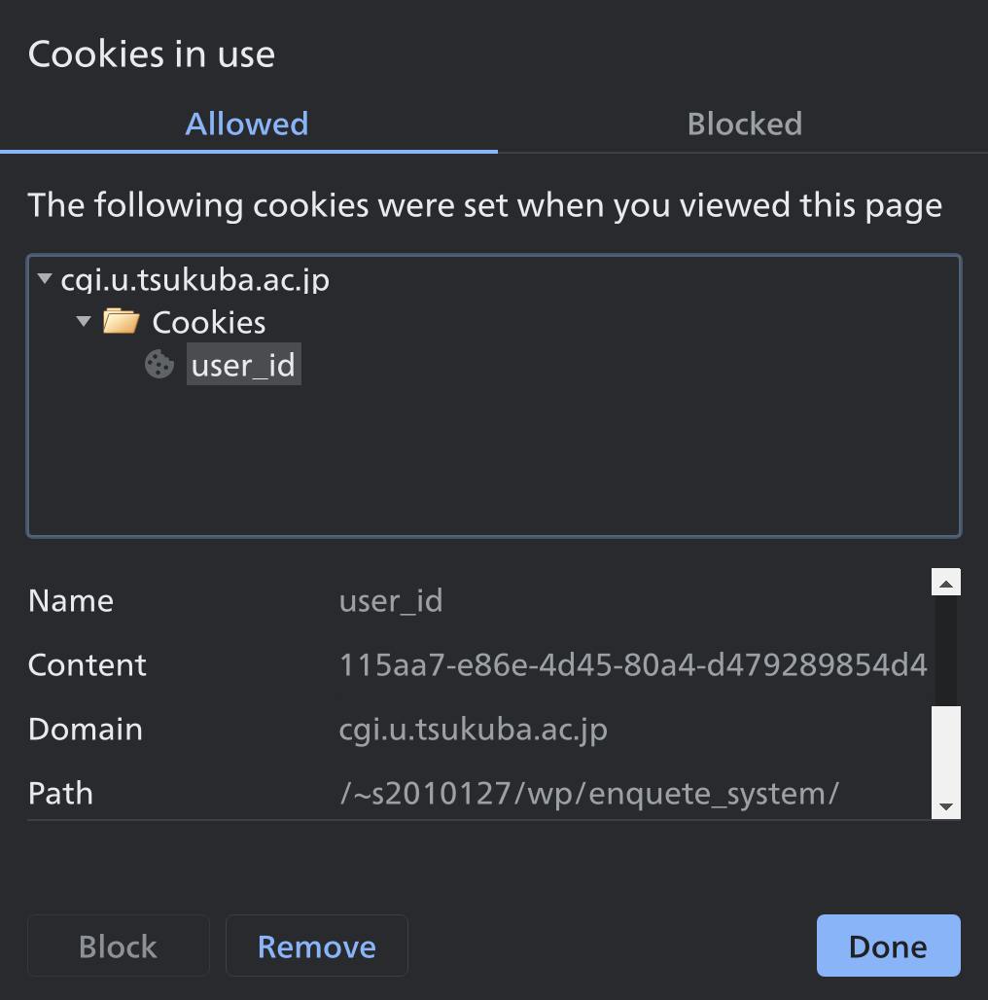
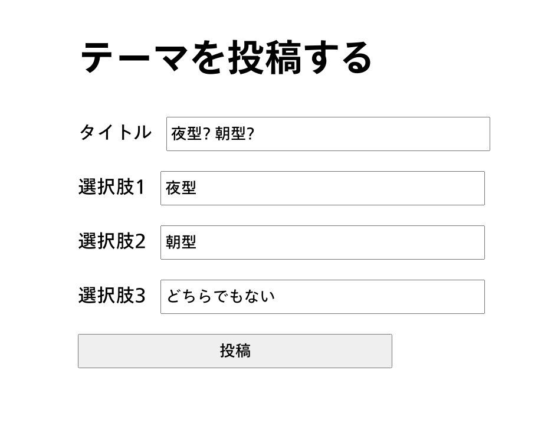
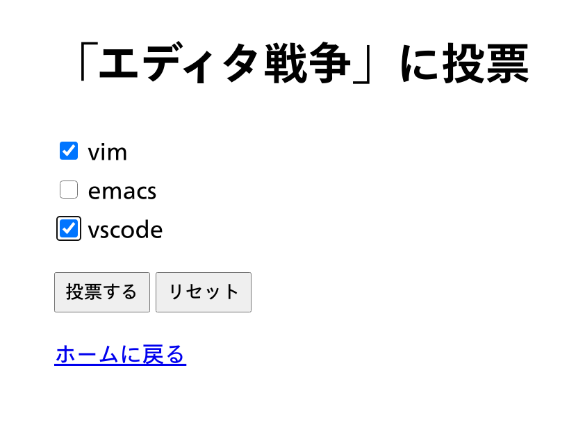
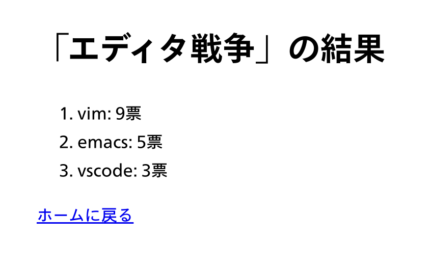

# かんたんアンケート

202010127 小林政貴

## アプリケーションの概要

[システム](http://cgi.u.tsukuba.ac.jp/~s2010127/wp/enquete_system/index.rb)
[ソースコード](https://github.com/mkobayashime/wp-2020)

授業で作成したアンケートシステムを拡張し、ユーザーが自由にアンケートを投稿・公開して回答を募ることのできるシステム
自分の投稿したアンケートは削除することができる

## 工夫した点

Cookie を用いて簡易的なユーザーの概念を実装しました。ログイン機構を実装するのは手間がかかりますが、Cookie に保存したユーザー ID を照らし合わせる方式は比較的簡単に実現できました。
ユーザー ID を含め、各種 primary key には UUID を用いました。

## ファイル

制作最初期に実装した一部ページを除き、基本的にはパラメータのバリデーションやデータベース操作といったバックエンドを`.rb`ファイルで処理し、`.rhtml`ファイルにデータを渡して表示する ERB 方式をとりました。フロントの実装をある程度分離できるという点では快適に開発できるように感じました。

## データベース

DBMS には Sqlite3 を採用しました。スキーマは以下のようなものです。

```
// アンケートテーマ
CREATE TABLE themes (
theme_id TEXT PRIMARY KEY,
user_id TEXT,
title TEXT);

// 選択肢
CREATE TABLE choices (
choice_id TEXT PRIMARY KEY,
theme_id TEXT,
text TEXT);

// 投票
CREATE TABLE votes(
theme_id TEXT,
choice_id TEXT,
user_id TEXT,
PRIMARY KEY (theme_id, choice_id, user_id)
);
```

## プログラム

ここでは投票を処理する[vote-submit.rb](https://github.com/mkobayashime/wp-2020/blob/af9f266f15b16e7b571c4eee3ef0606ab743a80c/vote_submit.rb)及び[vote-submit.rhtml](https://github.com/mkobayashime/wp-2020/blob/af9f266f15b16e7b571c4eee3ef0606ab743a80c/vote_submit.rhtml)について記述します

`vote-submit.rb`ではまず投票ページから POST で渡ってきたテーマ id/選択肢 id を簡単にバリデーションし、選択肢が 1 つも選択されていない場合や何らかの原因でテーマ id が渡っていない場合などにエラーを出しています。また Cookie からユーザー ID を読み出し、こちらも存在を確認しています。ユーザー ID はホームページでのみ付与する実装のため、ホームページを開き直すようエラーメッセージを入れています。
なお、`err`は最終的に ERB に渡されて表示されます。

```Ruby
err = ""

choice_ids = cgi.params["choice"]
if choice_ids.length === 0 then
  err += "Error: 何も選択されていません<br>"
end

theme_id = cgi.params["theme_id"][0]
if theme_id.empty? then
  err += "Error: theme_id not found<br>"
end

cookies = cgi.cookies
user_id = (cookies["user_id"][0] || "0").to_s
if user_id.empty? || user_id === "0" then
  err += "Error: ユーザー登録されていません<br>ホームを開いてからやり直してください<br>"
end
```

この後で`err`が空のままであれば以下のようなクエリを発行して投票をデータベースに反映し、その後 ERB を開いています。DB 操作で例外が発生した場合は先ほど同様`err`にエラーメッセージを入れ、ERB 側で表示するようにしています。
なお、ここで発行しているクエリは O(n) です。`insert into votes values (?, ?, ?), (?, ?, ?)...;`という形のクエリを一回発行するのみにしたかったのですが、配列の反復処理とプレースホルダをどのように組み合わせれば良いかがわからず妥協しました。

```Ruby
if err.empty? then
  begin
    SQLite3::Database.new("enquete_system.db") do |db|
      db.transaction() {
        choice_ids.each { |choice_id|
          db.execute("insert into votes (theme_id, choice_id, user_id) values (?, ?, ?);", theme_id, choice_id, user_id)
        }
      }
    end
  rescue => exception
    err += exception.message
  end
end

erb = ERB.new(File.read("vote_submit.rhtml"))
print erb.result(binding)
```

## スクリーンショット

ホームページ



ホームページ(投稿したテーマがある場合)



Cookie を用いたユーザー ID 保存



投稿ページ



投票ページ



結果表示ページ



## 授業の感想

Ruby という不慣れな言語ながら、毎週の課題の難易度や授業資料の情報の塩梅が自分に合っていたため、毎週楽しく課題に取り組めたように思います。最終課題をほぼ全て Ruby で実装して何より感じたのは動的型付け言語の不便さでした。

## 参照 URL

- https://docs.ruby-lang.org/ja/latest/method/Array/i/length.html
- https://qiita.com/yimajo/items/7fea5b2d880bf05e7a80
- https://qiita.com/motoki4917/items/ffc89d955e20b91d1014
- https://www.dbonline.jp/sqlite/table/index6.html
- https://itsakura.com/html-label
